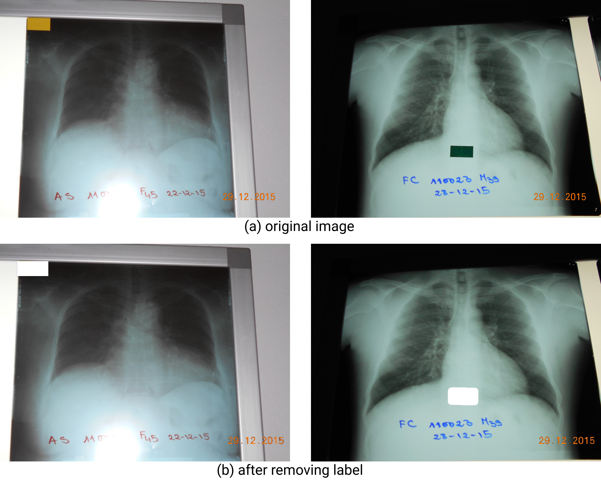
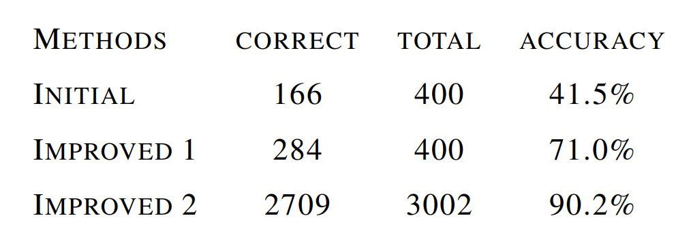
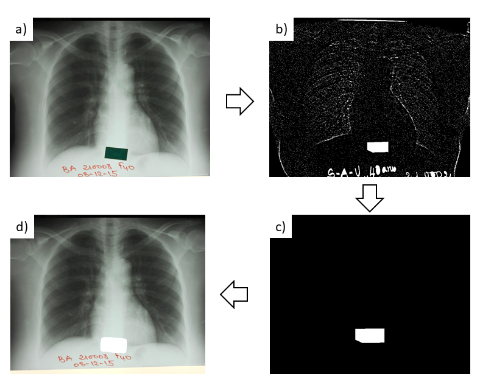
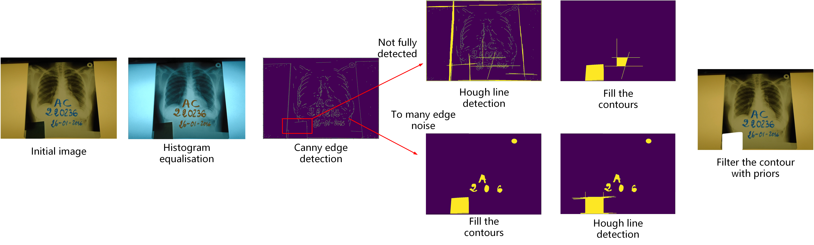

# CS433-ML-PROJECT2-TB DETECTION

### Detecting TB from chest x-rays in a population of patients living with HIV and diabetes in West Africa

**Team members**
- Haozhe Qi (EDIC) <haozhe.qi@epfl.ch>
- Mu Zhou (EDIC) <mu.zhou@epfl.ch>
- Anna Paulish (CSE) <anna.paulish@epfl.ch>

In this repository, you can find the code for TB detection from chest x-rays with HIV and diabetes in West Africa. 

In this project, we aim to:
- make a survey on the existing studies on TB detection from chest x-rays,
- test the existing methods (with code) on our dataset,
- do data preprocessing (especiall label remove for each images),
- prepare a pipeline for TB detection and show the performance on each subgroup (HIV and Diabetes).


### Contribution
- A new TB detection pipeline that can perform well on the challenging TB dataset. And various attempts for computer vision techniques like data preprocessing and augmentation, image classification models and training tricks.
- A label remove method that can automatically remove the labels in the original photos, and a label removed dataset that can be used to train learning based label remove methods.
- A wide thorough research of the existing TB detection methods and datasets, and a fair comparison with them.

### Baseline
To test as many as advanced computer techniques as we can, instead of using existing TB detection method as our baseline, we resort to build our baseline from scratch with deep learning classification library [TIMM](https://github.com/rwightman/pytorch-image-models). TIMM is a frequently updated library that already has 2.5k stars on the github. With the help of this library, we successfully build our baseline and test various advanced techniques in network architecture, loss function, optimiser and learning rate schedule.


### Data and models
Due to the privacy issue, we only release the data in the report. You can find the link in **section 3.1** in our report. \
All models you can find via [this link]( https://drive.google.com/drive/folders/1uWRxf4REA1D_d-jD3GN9xItkkQrYA_En?usp=sharing). \
Please note that you can access the data and models only by __epfl__ email. 

### Requirements
To run it properly:
16 GB of RAM.
A nvdia GPU with cuda support (even a cheap one).

```sh
# Install dependencies
pip install -r requirements.txt

# Install the library -- timm
pip install timm
```

### How to reproduce the results
For our baseline model, you can run a series of experiments by using:
```
bash run.sh
```
or run a single process with
```sh
python train.py --A_des 'train resnet with StepLR' \
                --model resnet50 --sched step --decay-epochs 50\
                --data_dir /home/project/data2/our_data_processed \
                --dataset_type all &> logs/res_step_lr.out
```
You can put your description of each experiment with argument **A_des**. You can update the model, path of dataset, and type of dataset by arguments **model** *(resnet50, efficientnet_b2)* , **data_dir** and **dataset_type** *('all' for whole dataset, 'D' for diabetes, 'H' for HIV)*.


### Code structure
```sh
- experiments
    ├── dataset.csv                ### whole dataset
    ├── train.csv                  ### training data
    ├── test.csv                   ### test data
─ preprocess                  
    ├── data_analysis.py           ### evaluate the number of each dataset
    ├── prepare_dataset.py         ### split train / val / test dataset
    ├── detect_rectangle.py        ### remove the labels (as described in report section 3.2.2 - improved method 1)
    ├── find_rectangle_new.py      ### remove the labels (as described in report section 3.2.3 - improved method 2)
    └── border_remove.py           ### remove the border and crop data (as described in section 3.3.1)
─ dataset  
    ├── dataset.py                 ### define the class of TB dataset
    └── data_loader.py             ### load the data
─ related_works
    ├── tbcnn                      ### comparison model 1
        ├── ...
    └── XTBTorch                   ### comparison model 2
        ├── ...
─ arguments.py                     ### all the arguments we need 
─ f1_loss.py                       ### calculate F1 loss
─ focal_loss.py                    ### focal loss
─ train.py                         ### train and test script
─ run.sh                           ### script to run the experiments
```
### Dataset overview
In the picture below you can see our original TB X-Ray images with labels on the left and the processed images without labels on the right:

 </br>

### Algorithm details - Label remove

Comparison between 3 label remove methods: 
 </br>
#### detect_rectangle.py (section 3.2.2)
The procedure of the improved method 1 (accuracy 71%):
</br>



`a)` - the original image </br>
`b)` - grayscale + adaptive threshold </br>
`c)` - after removing noise using morphological transformations </br>
`d)` - find rectangular contour + draw a rectangle with additional margins </br>

#### find_rectangle_new.py (section 3.2.3)
The procedure of the improved method 2 (accuracy 90.2%):



### Reference
- [TIMM](https://github.com/rwightman/pytorch-image-models): for our basline
- [TBCNN](https://github.com/frapa/tbcnn) : for comparision experiments
- [XTBTorch](https://github.com/frapa/tbcnn): for comparision experiments
- [lungs_segmentation](https://github.com/alimbekovKZ/lungs_segmentation): for lung segmentation on the data preprocessing stage
